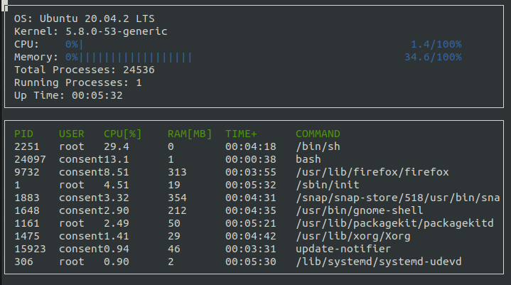

# Linux-System-Monitor

Starter code for System Monitor Project is adapted from the Object Oriented Programming Course of the [Udacity C++ Nanodegree Program](https://www.udacity.com/course/c-plus-plus-nanodegree--nd213). 

You can develop this project on your local machine.

## ncurses
[ncurses](https://www.gnu.org/software/ncurses/) is a library that facilitates text-based graphical output in the terminal. This project relies on ncurses for display output.

Install ncurses within your own Linux environment: `sudo apt install libncurses5-dev libncursesw5-dev`

## Make
This project uses [Make](https://www.gnu.org/software/make/). The Makefile has four targets:
* `build` compiles the source code and generates an executable
* `format` applies [ClangFormat](https://clang.llvm.org/docs/ClangFormat.html) to style the source code
* `debug` compiles the source code and generates an executable, including debugging symbols
* `clean` deletes the `build/` directory, including all of the build artifacts

## Instructions

1. Clone the project repository: `git clone https://github.com/sivateja93/C-plus-plus-Projects/edit/main/Linux-System-Monitor-Project.git`

2. Build the project: `make build`

3. Run the resulting executable: `./build/monitor`

4. Implement the `System`, `Process`, and `Processor` classes, as well as functions within the `LinuxParser` namespace.
